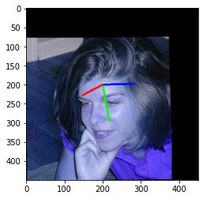
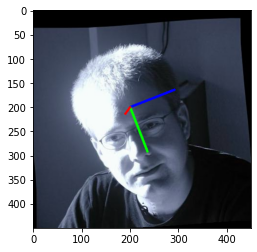
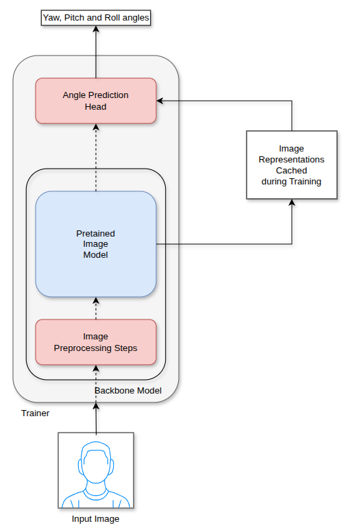

# Transfer learning for Head Pose Estimation

This project implements a system for training headpose estimation models using transfer learning on a frozen backbone image models(currently supports Inception V3 and MobileNet).

Originally inspired by this tensorflow [example](https://github.com/tensorflow/tensorflow/blob/v1.7.0/tensorflow/examples/image_retraining/retrain.py).

Also implements the angle prediction head from the HopeNet architecture([https://arxiv.org/pdf/1710.00925](https://arxiv.org/pdf/1710.00925))

  

## Setup
- Create a conda or venv environment with Python 3.7
- Install the dependencies using `uv pip install ".[test]"`
- Run the unit tests with `pytest tests`

## Running Experiments
### Donwload the datasets
1. 300W-LP synthesized large-pose face images (http://www.cbsr.ia.ac.cn/users/xiangyuzhu/projects/3DDFA/main.htm)
2. UPNA Headpose estimation dataset (https://www.unavarra.es/gi4e/databases/hpdb)
3. UPNA Synthetic Head Pose Database (https://www.unavarra.es/gi4e/databases/shpdb)

- Place the datasets under `data` folder at the root of the repository.

### Data Preprocessing
- Install the data preprocessing dependencies with `uv pip install ".[preprocess]"`
- `python scripts/python/run_dataset_preprocessing.py -c configs/experiments/preprocessing_config.yaml`

### Training a angle prediction head
- `python scripts/python/train_model.py -c configs/experiments/test_experiment.yaml`
- To view tensorboard logs run `tensorboard --logdir <EXPERIMENTS_DIR>/<EXPERIMENT_NAME>/tensorboard_logs`
    - To find out the `EXPERIMENTS_DIR` and `EXPERIMENT_NAME` check the experiment config.

## Architecture

## Future Extensions
1. Code:
    - Modernize the codebase in Pytorch or Tensorflow 2 and newer version of Python.
2. Modelling
    - Regularization
        - Add Dropout layers at the beginning of the model heads.
        - Apply gradient clipping during weight updates
        - Calculate the correlation between the weights and the loss as a form of regularization for each angle head
    - Not every Euler angle has the same range -- for example a person would have a much higher range of motion in yaw than in pitch and roll
        - In the HopeNet architecture restrict the angles choice buckets specific to the range for each Euler angle.
